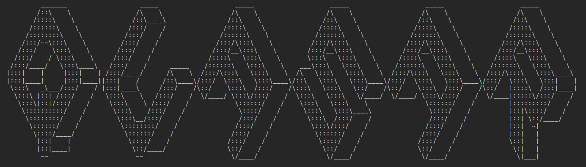

# Quasar Framework

**Quasar Framework** est un framework de réseau de neurones, écrit en Python, qui permet de construire, d'entraîner des modèles de réseaux de neurones. Il utilise des concepts fondamentaux tels que la propagation avant, la rétropropagation et le calcul des erreurs.

---

## 🚀 Fonctionnalités

- ✅ **Ajout de couches personnalisées** au réseau.
- ✅ Support des **couches d'activation** :
  - Fonction d'activation `relu`
  - Fonction d'activation `sigmoid`
  - Fonction d'activation `tanh`
  - Fonction d'activation `softmax`
- ✅ Support des **fonctions de perte** :
  - Erreur Absolue Moyenne `mae`
  - Erreur Quadratique Moyenne `mse`
- ✅ **Entraînement** des réseaux de neurones:
  - **Propagation avant** et **rétropropagation** pour l'entraînement des modèles.
  - Mise à jour des poids et des biais à l'aide de la **descente de gradient**.
- ✅ **Sauvegarder & Charger** des modèles déjà entrainés. Le format de sauvegarde des modèles est `json`.

---

## 🛠️ Installation

Pour utiliser ce framework, assurez-vous d'avoir **Python 3.x** installé sur votre machine. Ensuite, clonez le dépôt et installez les dépendances nécessaires :

```bash
git clone git@github.com:EliottJVN/Quasar_Framework.git
cd Quasar_Framework
pip install numpy json
```

---

## 📘 Utilisation

Voir le dossier **`Tutorials`**.

---

## 📂 Structure du code

Le framework est organisé en plusieurs fichiers :

- **`network.py`** : Contient la classe `Network`, qui gère l'architecture et l'entraînement du réseau.
- **`layer.py`** : Contient la classe `Layer`, qui représente une couche individuelle du réseau.
- **`activationlayer.py`** : Contient la classe `ActivationLayer`, qui représente une couche d'activation du réseau. Les fonctions d'activation se trouvent dans le fichier `activationfunctions.py`.
- **`error.py`** : Contient la classe `Error`, qui calcule les erreurs et les gradients.

---

## 🤝 Contributions

Les contributions sont les bienvenues ! 🎉  
Si vous souhaitez contribuer à ce projet, veuillez créer une **issue** ou soumettre une **pull request**.

---


